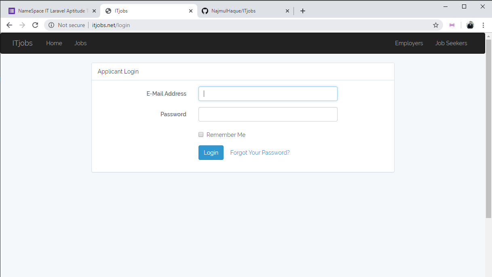

#### Project title: ITjobs.net 

1.Introduction:
  This is an unofficial IT jobs site. Through this site we will able to find IT jobs.In backend PHP, MySQL, Laravel framework are used. i am working on the backend to complete this project.
  
2.1 User Interface:-
 
   
  
   
  
   

   

  

  

  

   

  

   

   
